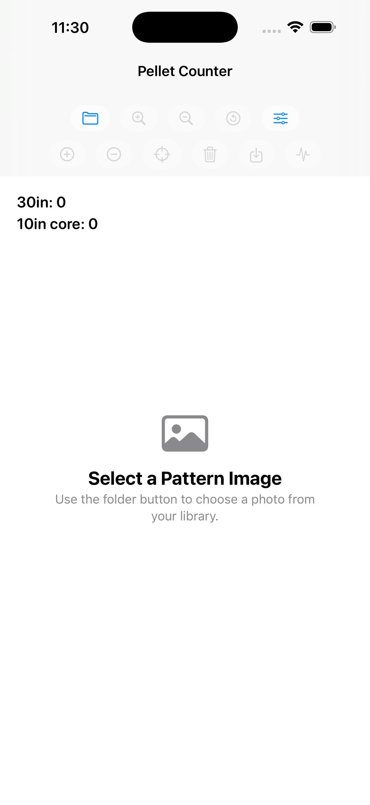
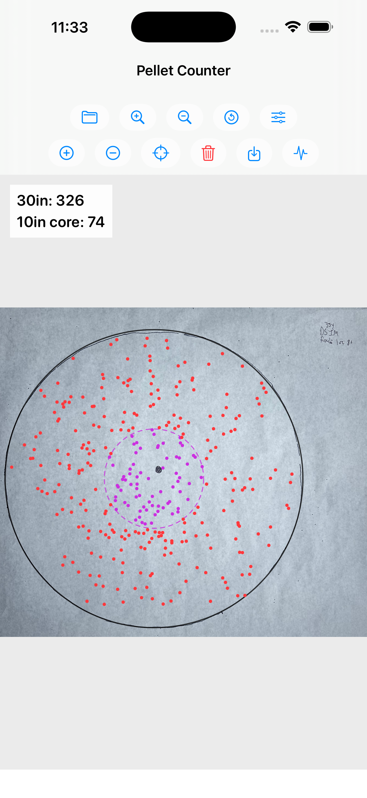
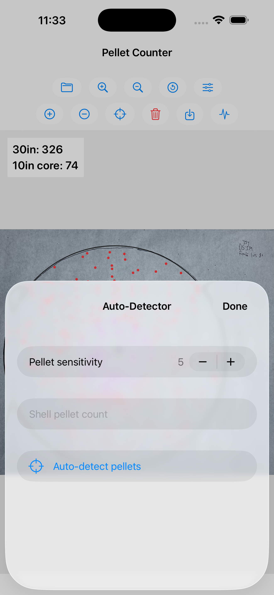

# Shotgun Pellet Analyzer

Shotgun Pellet Analyzer is an iOS app for reviewing shotgun pattern photos and estimating pellet distribution inside a standard 30-inch pattern circle.

The app is designed for shooters who want a practical field tool for pattern testing. Select a pattern photo from your photo library, run automatic pellet detection, adjust the results when needed, and save a marked-up image with the pellet counts included.

## What It Does

- Detects pellet strikes in shotgun pattern photos
- Counts pellets inside the 30-inch pattern circle
- Reports pellets inside the 10-inch core
- Supports manual add/remove correction after detection
- Lets you zoom and pan for detailed review
- Saves an annotated image back to your photo library
- Supports an optional shell pellet count for percentage calculations

## Screenshots

<table>
  <tr>
    <td align="center" width="33%">
      
       
      <strong>Select a Pattern</strong>
    </td>
    <td align="center" width="33%">
      
       
      <strong>Automatic Detection</strong>
    </td>
    <td align="center" width="33%">
      
       
      <strong>Zoom and Review</strong>
    </td>
  </tr>
</table>

## Getting Started With Patterns

New to shotgun patterning, or want cleaner app results?

[Getting Started With Shotgun Patterns](getting-started-with-shotgun-patterns.md) covers useful equipment, drawing the 30-inch circle, lighting, and photo tips.

## Support

For questions, bug reports, or feature requests, open an issue in this repository:

[Shotgun Pellet Analyzer Support Issues](https://github.com/keusej/ShotgunPelletAnalyzer_ios/issues)

When reporting a detection issue, it helps to include:

- The app version
- The iPhone or iPad model
- Whether the target was paper or cardboard
- A description of what was missed or falsely detected

Please avoid posting sensitive personal information in public issues.

## Privacy

Shotgun Pellet Analyzer processes selected images locally on your device. It does not create accounts, upload photos, collect personal information, track users, or use advertising.

[Privacy Policy](PRIVACY.md)
