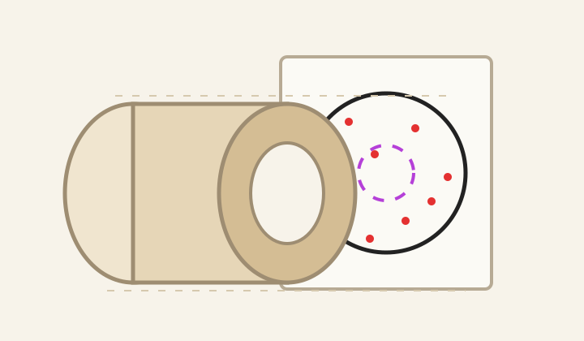
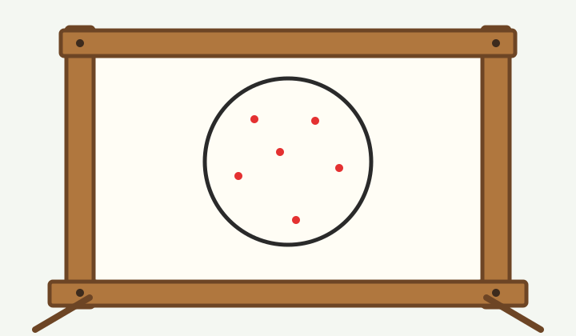
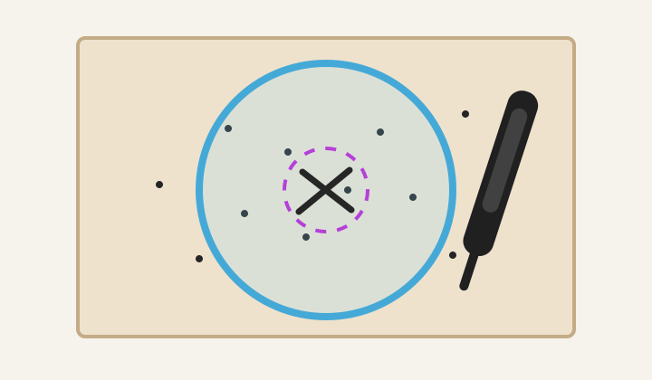

# Getting Started With Shotgun Patterns

Good pattern photos start with good pattern targets. Shotgun Pellet Analyzer works best when the paper is large, flat, evenly lit, and photographed square-on. The app can either find the 30-inch analysis circle from a measured calibration line, or use a 30-inch circle that you draw on the target.

[Back to Support](index.md)

## Helpful Equipment

These are not required, but they make consistent patterns much easier to collect.

<table>
  <tr>
    <td width="33%" align="center">
      
       
      <strong>Wide Patterning Paper</strong>
       
      Use paper at least 36 inches wide. A 48-inch roll gives plenty of room around the 30-inch circle.
       
      <a href="https://a.co/d/0eS2AGhS">Example paper roll</a>
    </td>
    <td width="33%" align="center">
      
       
      <strong>Paper Frame</strong>
       
      A reusable frame keeps the target flat and easy to replace. Replaceable 2x4s are handy after repeated use.
       
      <a href="https://a.co/d/0bCtTg8k">Example target frame</a>
    </td>
    <td width="33%" align="center">
      
       
      <strong>Optional 30-Inch Circle Template</strong>
       
      A string, cardboard guide, or clear plexiglass circle can still be useful if you prefer to draw the circle yourself.
       
      <a href="https://a.co/d/0cennMPR">Example clear circle</a>
    </td>
  </tr>
</table>

## Before You Shoot

Use fresh, unmarked paper when possible. Black marker circles around pellet holes can confuse automatic detection because the marker can look similar to pellet damage.

Mount the paper flat and square to the shooter. Wrinkles, deep folds, and heavy shadows can look like pellet strikes in photos.

Make sure the paper is large enough for the whole pattern. A standard shotgun pattern is usually evaluated inside a 30-inch circle, so extra margin around the pellet cloud helps the app ignore background.

## Calibration Line Method

The recommended method is to draw a straight calibration line on the target after shooting. The app uses that known length to calculate how large a 30-inch circle should be in the photo, then places the circle around the densest part of the pellet pattern.

Use a dark, straight, high-contrast line. A 12-inch line works well because it is easy to draw with a ruler and large enough for the app to detect accurately.

Tips:

- Draw the line away from the densest pellet area so it does not cover pellet holes.
- Keep the line fully on the target paper.
- Use one clean stroke if possible.
- Avoid placing the line on a fold, heavy shadow, tape edge, or background object.
- In the app settings, leave **Find circle from line** selected and enter the real line length in **Length of line (inches)**.

If the photo includes a lot of background, use the dashed rectangle tool in the app to draw a search region around the target paper, calibration line, and pellet pattern before detecting.

## Optional Drawn 30-Inch Circle

You can still draw the 30-inch circle yourself. After shooting, place the 30-inch circle around the densest part of the pellet pattern, not necessarily around the aiming point.

Common methods:

- Tie a pencil to a 15-inch string and rotate it around the chosen center.
- Cut a 30-inch cardboard circle and trace around it.
- Use a clear 30-inch plexiglass circle so you can see the pellet distribution while centering it.

Use a dark, clean line. Avoid repeatedly tracing the circle or making a very thick border. In the app settings, choose **Use drawn 30in circle** for this workflow.

## Taking the Photo

Lay the target flat on the ground or another flat surface.

Use bright, even light. Outdoor shade or indirect daylight usually works better than harsh sun.

Hold the phone as square to the paper as possible. The calibration line and pellet pattern should be visible. If you drew a 30-inch circle, the whole circle should be visible with a little margin around it.

Avoid strong shadows from your body, the phone, trees, range structures, or folds in the paper.

Take a sharp, high-resolution photo. If the pellet holes are tiny or faint, move closer while keeping the calibration line and pellet pattern visible.

## In the App

Open the photo, choose the detector mode in settings, run detection, then zoom in and review the results. Add any missed pellet strikes and remove false detections before saving the marked image.

If you know the pellet count in the shell, enter it in settings so the app can report pattern percentages.

## Quick Checklist

- Large paper, preferably 48 inches wide
- Paper flat on a frame or flat surface
- 12-inch calibration line, or optional 30-inch circle
- Calibration line and pellet pattern visible in the photo
- Even lighting with minimal shadows
- No marker circles around individual pellet holes
- Review and correct detections before saving
