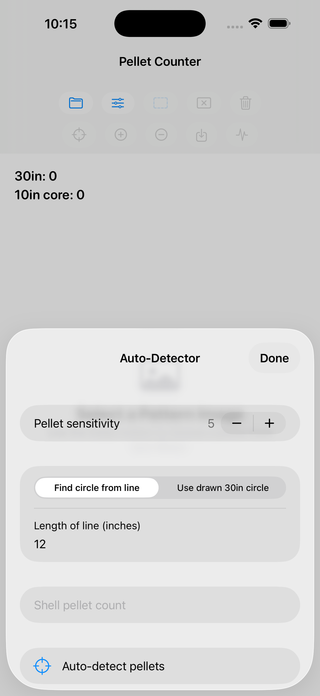

# Shotgun Pellet Analyzer Support

Shotgun Pellet Analyzer helps shotgun shooters analyze pattern photos on iPhone and iPad.

Use the app to select a photo from your library, detect pellet strikes, review and correct detections, and save an annotated pattern image with pellet counts.

## Key Features

- Automatic pellet strike detection
- Manual correction by tapping detected or missed pellets
- 30-inch pattern count
- 10-inch core count
- Optional shell pellet count and percentage display
- Zoom and pan for close review
- Annotated image export to Photos

## New to Patterning?

Good analysis starts with a good target photo. See the setup guide for paper, target frames, calibration lines, optional 30-inch circles, lighting, and photo tips:

[Getting Started With Shotgun Patterns](getting-started-with-shotgun-patterns.md)

## Screenshots

<table>
  <tr>
    <td align="center" width="33%">
      
       
      <strong>Select a Pattern</strong>
    </td>
    <td align="center" width="33%">
      
       
      <strong>Detector Settings</strong>
    </td>
    <td align="center" width="33%">
      
       
      <strong>Automatic Detection</strong>
    </td>
  </tr>
</table>

## Using the App

The main screen is built around the pattern photo. Use pinch gestures to zoom, drag to pan while zoomed, and tap pellet markers to make corrections.

Toolbar actions:

- **Folder**: choose a pattern photo from your library.
- **Sliders**: open detector settings.
- **Dashed rectangle**: draw a search region around the paper, calibration line, and pellet pattern. Drag the box or its corners to adjust it.
- **Rectangle with X**: clear the search region.
- **Trash**: clear current pellet markers.
- **Crosshair**: run automatic pellet detection.
- **Plus / minus circles**: increase or decrease marker dot size.
- **Save**: save the marked image with counts and percentages.
- **Waveform**: save the detector heatmap for troubleshooting.

Detector settings:

- **Find circle from line**: use a straight calibration line on the target to estimate scale, then place the 30-inch analysis circle around the densest pellet region.
- **Use drawn 30in circle**: use a visible 30-inch circle already drawn on the target.
- **Length of line (inches)**: enter the real length of the calibration line, commonly 12 inches.
- **Pellet sensitivity**: increase if real holes are missed, decrease if folds or marks are detected as pellets.
- **Pellets in shell**: optional total pellet count; when set, the app reports pattern percentages.

After detection, zoom in and review. Tap to add a missed pellet. Double-tap or long-press near a marker to remove it.

## Getting Help

For support, bug reports, or feature requests, open a GitHub issue:

[Open a Support Issue](https://github.com/keusej/ShotgunPelletAnalyzer_ios/issues)

Helpful details include the app version, device model, target material, and what result looked incorrect.

## Privacy

The app analyzes photos locally on your device and does not upload your images.

[Read the Privacy Policy](PRIVACY.md)
